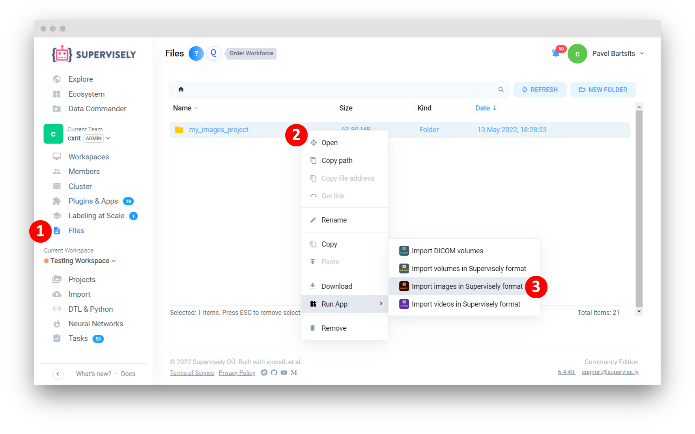
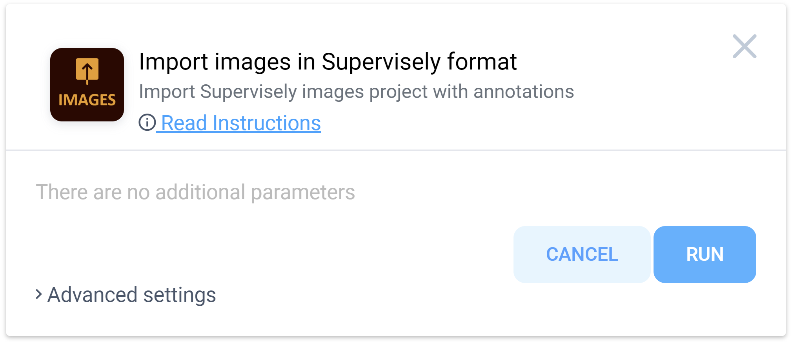
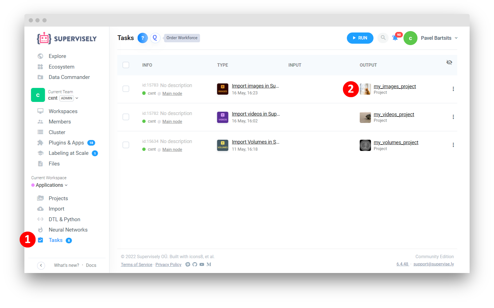
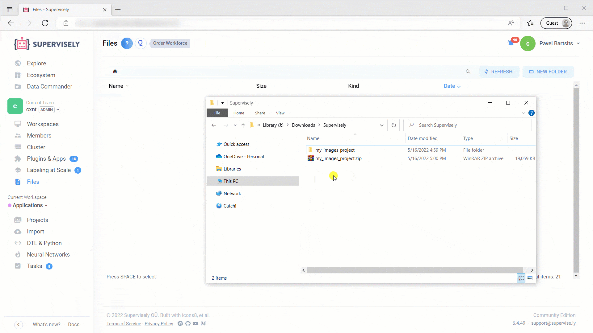

<div align="center" markdown>


# Import Images in Supervisely format

<p align="center">
  <a href="#Overview">Overview</a> •
  <a href="#How-to-Run">How to Run</a> •
  <a href="#Demo">Demo</a>
</p>

[](https://ecosystem.supervise.ly/apps/supervisely-ecosystem/import-images-in-sly-format)
[](https://supervise.ly/slack)

[](https://supervise.ly)
[](https://supervise.ly)

</div>

# Overview

Import images in [Supervisely format](https://docs.supervise.ly/data-organization/00_ann_format_navi) with annotations. Supported extensions: `.jpg`, `.jpeg`, `.mpo`, `.bmp`, `.png`, `.webp`.

🏋️ Starting from version `v1.3.2` application supports import from special directory on your local computer. It is made for Enterprise Edition customers who need to upload tens or even hundreds of gigabytes of data without using drag-ang-drop mechanism:

1. Run agent on your computer where data is stored. Watch [how-to video](https://youtu.be/aO7Zc4kTrVg).
2. Copy your data to special folder on your computer that was created by agent. Agent mounts this directory to your Supervisely instance and it becomes accessible in Team Files. Learn more [in documentation](https://docs.supervise.ly/customization/agents/agent-storage). Watch [how-to video](https://youtu.be/63Kc8Xq9H0U).
3. Go to `Team Files` -> `Supervisely Agent` and find your folder there.
4. Right click to open context menu and start app. Now app will upload data directly from your computer to the platform.

#### Input files structure

You can upload a directory or an archive. If you are uploading an archive, it must contain a single top-level directory.

Directory name defines project name. Subdirectories define dataset names.

Project directory example:

```
.
cats_vs_dogs_project
├── cats
│   ├── ann
│   │   ├── cats_1.jpg.json
│   │   ├── ...
│   │   └── cats_9.jpg.json
│   └── img
│       ├── cats_1.jpg
│       ├── ...
│       └── cats_9.jpg
├── dogs
│   ├── ann
│   │   ├── dogs_1.jpg.json
│   │   ├── ...
│   │   └── dogs_9.jpg.json
│   └── img
│       ├── dogs_1.jpg
│       ├── ...
│       └── dogs_9.jpg
└── meta.json
```

As a result we will get project `cats_vs_dogs_project` with 2 datasets named: `cats` and `dogs`.

# How to Run

**Step 1.** Add [Import images in Supervisely format](https://ecosystem.supervise.ly/apps/supervisely-ecosystem/import-images-in-sly-format) app to your team from Ecosystem


**Step 2.** Run the application from the context menu of the directory with images on Team Files page

  

**Step 3.** Press the Run button in the modal window



**Step 4.** After running the application, you will be redirected to the Tasks page. Once application processing has finished, your project will become available. Click on the project name to open it.



### Demo
Example of uploading images project with annotations to Supervisely:



